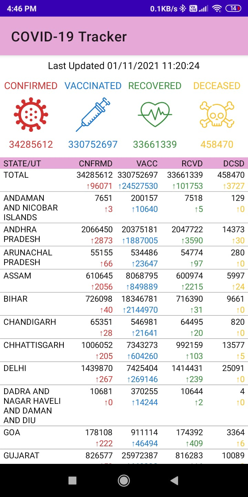

### COVID-19_Tracker_India
An app that fetches and displays the current stats of Covid cases for all states in India

#### _App Screenshots_

#### _Libraries/Technology used_
- Ok Http
- Gson
- Kotlin Coroutines
- [Api used](https://api.covid19india.org/data.json)
